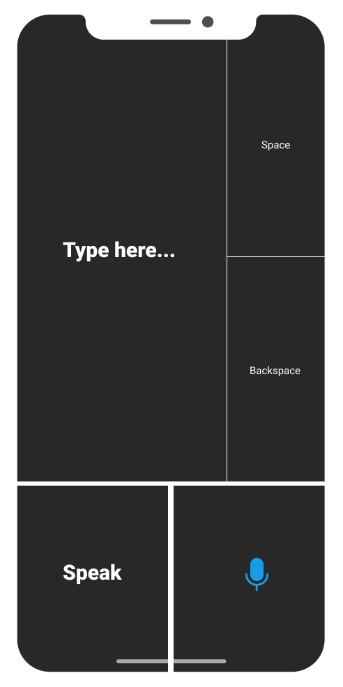
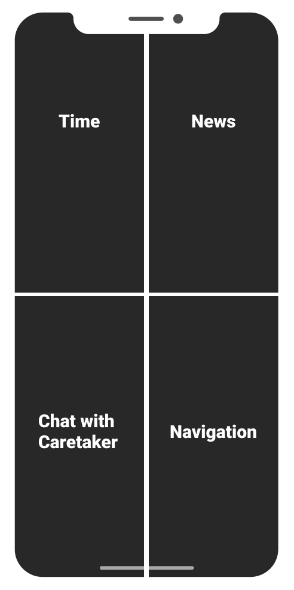
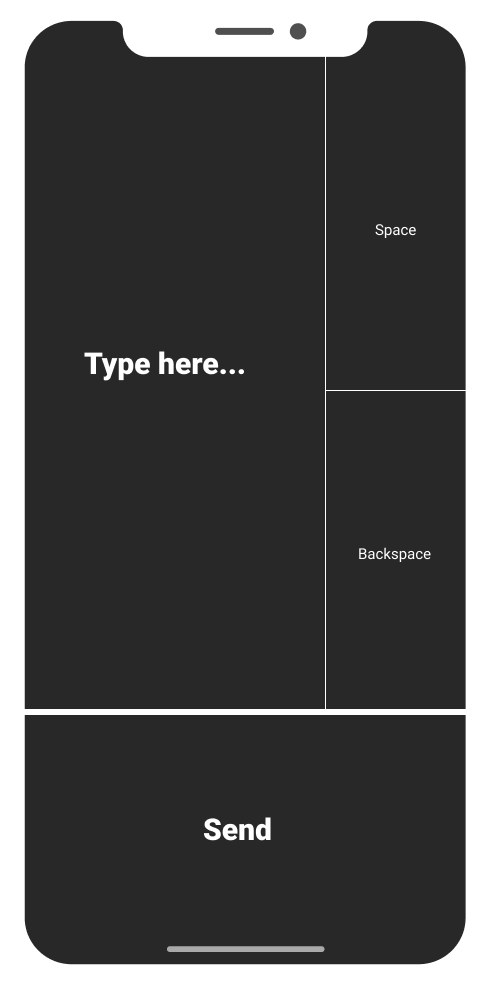

# Team shuvamk_6b12

# PROJECT Sahayak.ai

``` Problem Statement - Communication App for the Deaf-Blind ```

<p align="center">
  
  
  
  
  
</p>

This application is developed to help deaf-blind people interact with others with ease.
The app is designed in such a way that it can be used just by using taps, swipes and other gestures, so that a deafblind person can easily use it.
Allows the deafblind person to communicate using AI and touch patterns. The other person won't need the app to communicate with the deafblind person.
Provides the deafblind user the ability to perform some basic daily activities by the combination of some mere touches and taps, such as map navigation, get news updates, get the time, or chat with someone.


### Prerequisites

* NodeJS 
* Expo Cli 
* Cocoapods 
* Homebrew 
* Android Studio (for Android) 
* Xcode (For iOS) 
* Python3

### Running the Platform

Clone the repository and run the following commands: 
* $ [sudo] gem install cocoapods $ cd ios && pod install 
* $ npm i 
* $ npm start

To run the python environment: 
* python -m venv venv/ (Create a virtual Environment) 
* source venv/bin/activate (Activating Virtual Environment) 
* pip install flask pip install --upgrade rev_ai python stt.py


## Important Links
* Presentation - [PPT Link](https://he-s3.s3.ap-southeast-1.amazonaws.com/media/sprint/rakathon-2021/team/976641/282c1a5sahayak__1_.pdf)
* Video Link - [Video Link](https://drive.google.com/file/d/1fcZFtdTMGGvrz5oeXlEa52rfVN9smqLl/view?usp=sharing)

